

# HOPE Beneficiary Portal User Manual

## About

The HOPE Beneficiary Portal allows beneficiaries to securely access the information recorded in the system about their household and programme participation.

Through the portal, beneficiaries can view their personal and household information, check payments made to them, raise concerns, provide feedback, or report issues through the grievance functionality.

The portal reduces the need for beneficiaries to rely solely on intermediaries and provides greater transparency and confidence that their requests and grievances have been recorded and can be followed up. The portal provides an alternative and direct channel for beneficiaries to submit grievances. This may be particularly important for beneficiaries who do not feel comfortable using other available grievance channels, are uncertain whether their grievance will reach the responsible team, or are conceThank yorned about possible retaliation or negative consequences, such as unfair treatment or exclusion from assistance, after reporting an issue.

After identity verification, beneficiaries can:

- View their household profile and demographic details.
- View linked programmes, payment statuses, and grievance tickets.
- View payments already made to them and upcoming payments, when available.
- Submit a new grievance, concern, feedback, complaint, or request.
- Request a correction or update to information recorded about them.
- Create, view, or reset their portal login credentials, including their username and password.

The portal includes anti-abuse and data-protection measures to safeguard beneficiary information. Login attempts are rate-limited, and repeated unsuccessful identity-verification attempts may result in a temporary lockout. These measures help prevent unauthorized access and ensure that beneficiary information remains secure.

## Before You Start
Access the HOPE Beneficiary Portal using the following link:

Portal link: https://portal-hope.unicef.org/

Before accessing the HOPE Beneficiary Portal, make sure that you have:

- Your registration number, email address, or phone number provided at the time of registration.
- Access to a mobile phone, tablet, or computer.
- An internet connection.
- Access to a web browser.
- The information needed to answer questions about yourself or your household during identity verification.

Protecting Your Information

- Use a personal or trusted device whenever possible.
- Make sure that you are using the official portal link.
- Do not share your registration number, username, password, OTP, or answers to verification questions.
- Log out when you finish, especially when using a shared device. The portal session will automatically end after a period of inactivity.
- Do not save your username or password on a public or shared device.

## Accessing the Portal

Follow the steps below to access the HOPE Beneficiary Portal:

1) Open a supported web browser on your phone, tablet, or computer.
2) Enter the official HOPE Beneficiary Portal link in the address bar.
3) On the welcome page, select your preferred language.
4) Select one of the available login methods.

Note: The available login methods may depend on the contact and account information recorded for the beneficiary in HOPE.

<table class="steps-table">
<tr>
<td>
<b>Select your preferred language and choose one of the four available login methods</b>
</td>
</tr>
<tr>
<td>

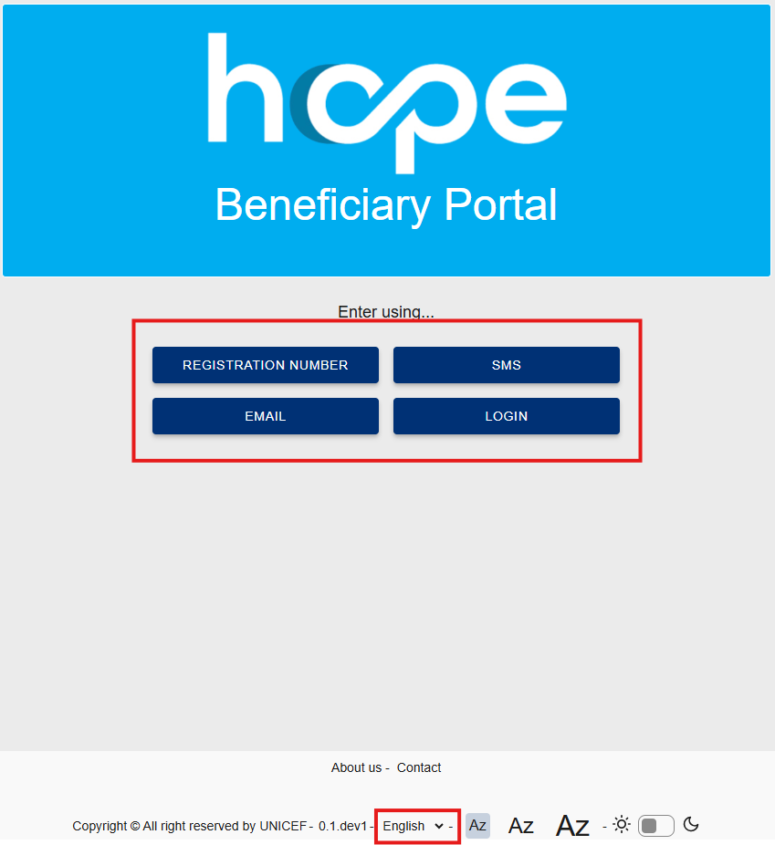
</td>
</tr>
</table>

## Login Methods

The HOPE Beneficiary Portal supports four login methods:

### 1) Registration Number

You can access the portal using the registration number you received during registration.

1. Select REGISTRATION NUMBER.
2. Enter your registration number in the relevant field, then select VALIDATE.
3. Answer the identity-verification questions displayed by the portal, then select VALIDATE.

After successful identity verification, you are redirected to the Household Page, where you can view your household, programme, payment, and grievance information.

<table class="steps-table">
  <tr>
    <td><b>Step 1: Select REGISTRATION NUMBER</b></td>
    <td ><b>Step 2: Enter your registration number</b></td>
    <td ><b>Step 3: Answer the verification questions</b></td>
  </tr>
  <tr>
    <td>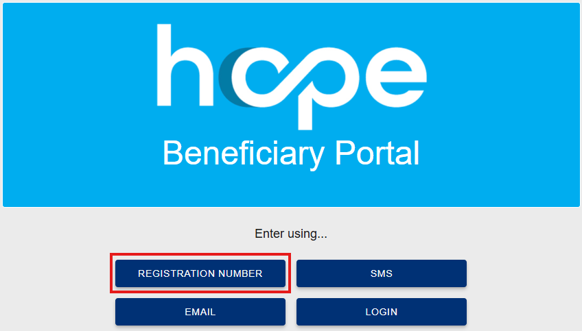</td>
    <td>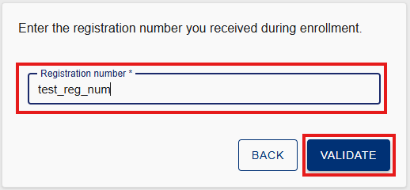</td>
    <td></td>
  </tr>
</table>

### 2) SMS verification
You can access the portal using the mobile number provided during registration. 

1. Select SMS.
2. Enter your mobile number in the relevant field, then select VALIDATE.
3. The portal sends a one-time password (OTP) by SMS to the registered mobile number. The OTP is valid for five minutes.
4. Enter the OTP in the relevant field, then select VALIDATE.

After successful OTP verification, you are redirected to the Household Page, where you can view your household, programme, payment, and grievance information.

<table class="steps-table">
  <tr>
    <td ><b>Step 1: Select SMS</b></td>
    <td ><b>Step 2: Enter your mobile number</b></td>
    <td ><b>Step 3: Enter the one-time password (OTP) received by SMS</b></td>
  </tr>
  <tr>
    <td>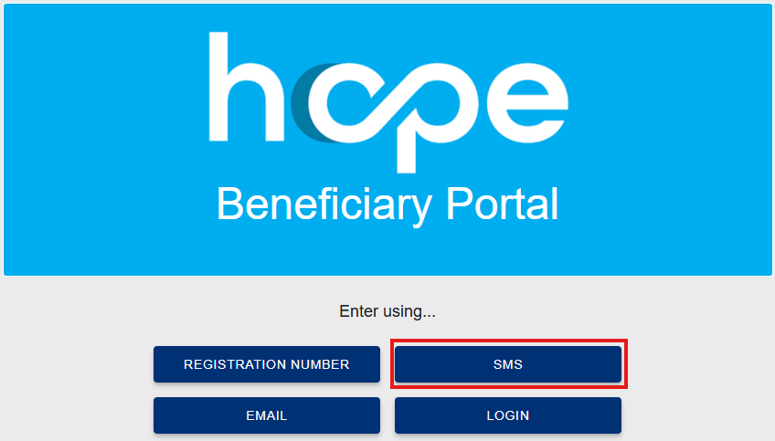</td>
    <td>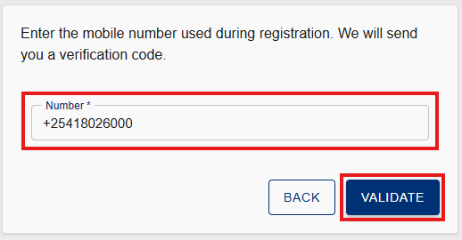</td>
    <td>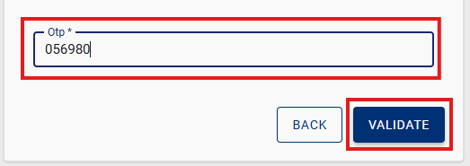</td>
  </tr>
</table>

### 3) Email verification

You can access the portal using the email address provided during registration.

1. Select EMAIL.
2. Enter your email address in the relevant field, then select VALIDATE. The portal sends a one-time password to the registered email address. The OTP is valid for five minutes.
3. Enter the OTP in the relevant field, then select VALIDATE.

After successful OTP verification, you are redirected to the Household Page, where you can view your household, programme, payment, and grievance information.
<table class="steps-table">
  <tr>
    <td ><b>Step 1: Select EMAIL</b></td>
    <td ><b>Step 2: Enter your email address</b></td>
    <td ><b>Step 3: Enter the one-time password (OTP) received by email</b></td>
  </tr>
  <tr>
    <td>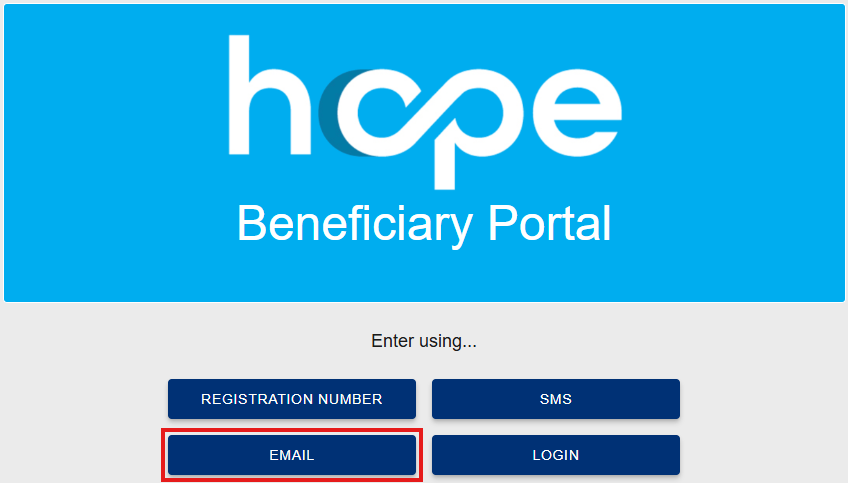</td>
    <td>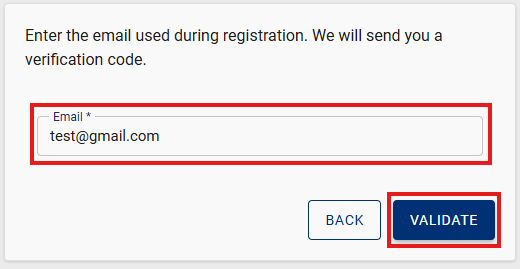</td>
    <td>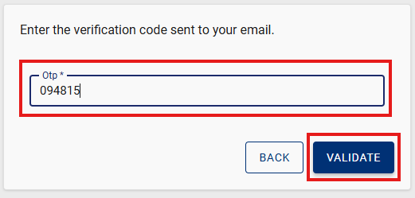</td>
  </tr>
</table>

### 4) Account Login Using Username and Password

You can access the portal using previously created account credentials. These credentials can be created after successfully accessing the portal through one of the other three verification methods: Registration Number, SMS, or Email.

1. Select LOGIN.
2. Enter your username and password in the relevant fields, then select SIGN IN.

After successful login, you are redirected to the Household Page.

<table class="steps-table">
  <tr>
    <td ><b>Step 1: Select LOGIN</b></td>
    <td ><b>Step 2: Enter your username and password, then select SIGN IN</b></td>
    
  </tr>
  <tr>
    <td>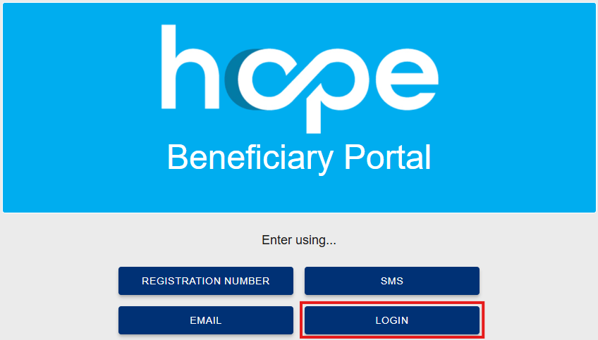</td>
    <td>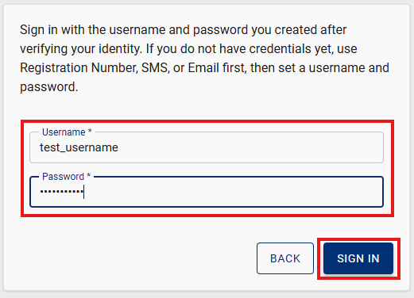</td>
  </tr>
</table>

### Creating or Resetting Login Credentials

After successful identity verification using Registration Number, SMS, or Email, select VIEW OR RESET LOGIN. On this page, you can create login credentials for the first time or manage existing login credentials.

1. If you do not have login credentials, enter a username and password.
2. If login credentials already exist, you can view or update your username, reset your password, or both.
3. For security reasons, your existing password cannot be displayed. If you do not remember your password, you must set a new one.
4. Select SAVE LOGIN to save your changes.
5. During future visits, select LOGIN and enter your username and password. You will not need to repeat the Registration Number, SMS, or Email verification process.
<table class="steps-table">
  <tr>
    <td ><b>Step 1: On the Household Page, select VIEW OR RESET LOGIN</b></td>
    <td ><b>Step 2: Create or update your username, reset your password, or both, then select SAVE LOGIN</b></td>
    
  </tr>
  <tr>
    <td>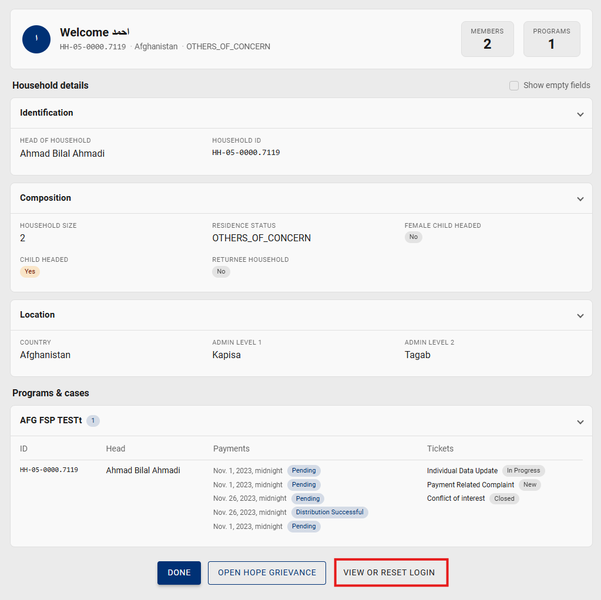</td>
    <td>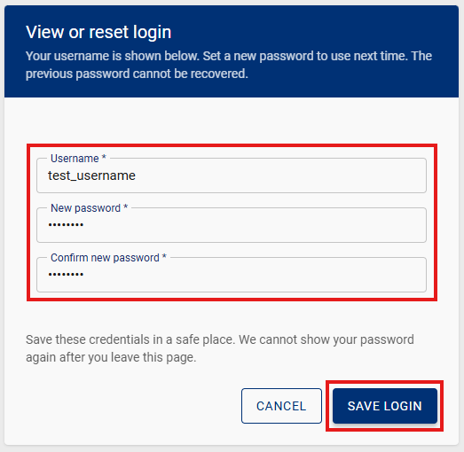</td>
  </tr>
</table>

## Household Page
After successful identity verification or login, you are redirected to the Household Page.

The top of the page displays a welcome message and summary information, including the household ID, country, residence status, number of household members, and number of programmes linked to the household.

You can review the following sections:

1. Identification: Displays the name of the head of household and the household ID.
2. Composition: Displays household information, including household size, residence status, and other relevant household characteristics.
3. Location: Displays the household’s registered location, including the country and available administrative levels.
4. Programmes and Cases: Displays programmes linked to the household, payment information and statuses, and submitted grievance tickets and their statuses.

Select the arrow next to a section to expand or collapse the information. You can also select SHOW EMPTY FIELDS to display fields for which no information is currently recorded. If any information is missing, incorrect, or outdated, you can submit a data-update request through the grievance functionality.

At the bottom of the page, you can:

1. Select **DONE** to leave the Household Page and securely end your portal session.
2. Select **OPEN HOPE GRIEVANCE** to submit a new grievance, concern, feedback, complaint, or request.
3. Select **VIEW OR RESET LOGIN** to create, view, or update your username, reset your password, or both.

<table class="steps-table">
<tr>
<td>
<b>Household Page: Review household, programme, payment, and grievance information</b>
</td>
</tr>
<tr>
<td >
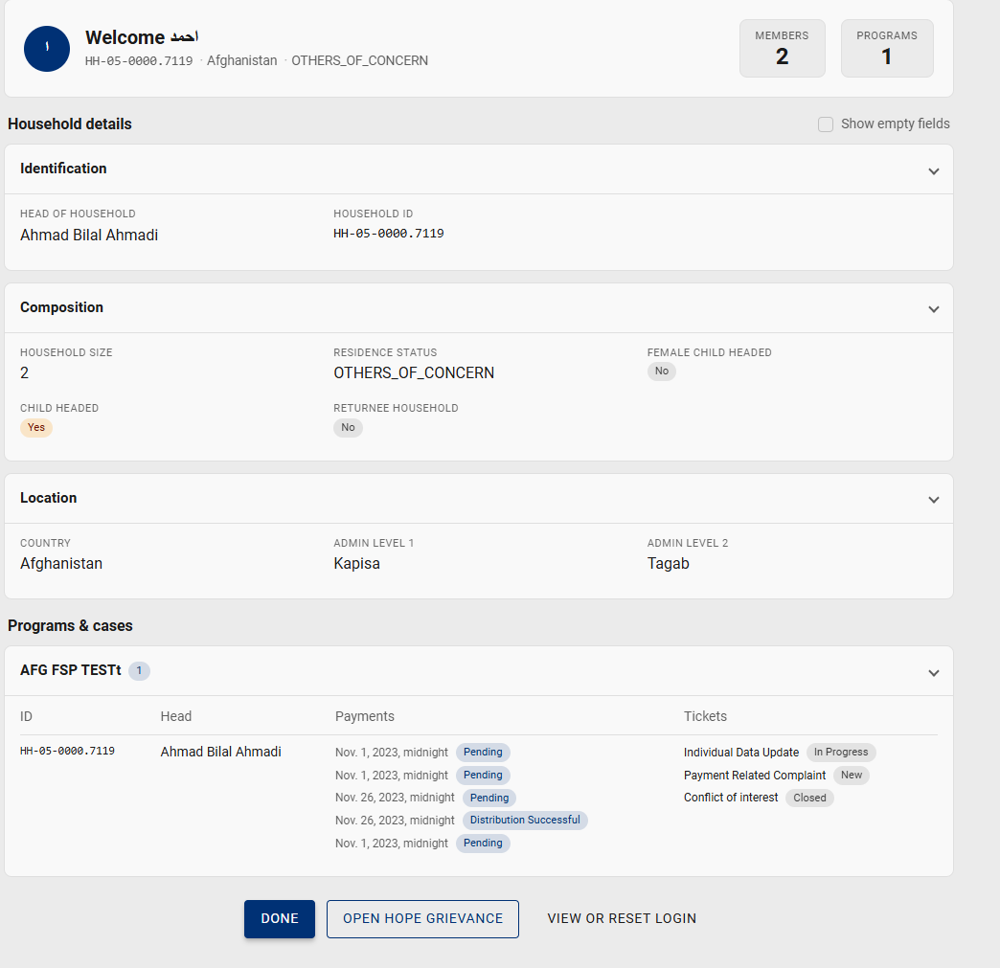</td>
</td>
</tr>
</table>

## Submitting a Grievance
You can submit a grievance, concern, feedback, complaint, or request directly through the portal.

1. On the Household Page, select OPEN HOPE GRIEVANCE.
2. The grievance form is displayed.
3. Enter a clear description of your grievance, concern, feedback, complaint, or request.
4. Select CREATE to submit the grievance.
5. After successful submission, the portal creates a grievance ticket that you can use to follow up on your case.

You can return to the Programmes and Cases section of the Household Page to view your submitted grievance ticket and its current status. If the grievance relates to a data-update request, the updated information will automatically appear in the portal after the request has been completed and the ticket has been closed.

<table class="steps-table">
  <tr>
    <td ><b>Step 1: On the Household Page, select OPEN HOPE GRIEVANCE</b></td>
    <td ><b>Step 2: Enter the grievance description, then select CREATE</b></td>
    
  </tr>
  <tr>
    <td>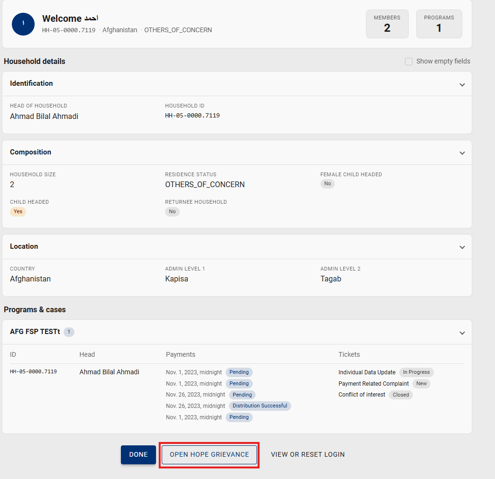</td>
    <td>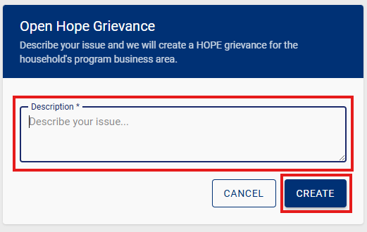</td>
  </tr>
</table>

## Leaving the Portal
 
When you have finished using the portal, select **DONE** to leave the Household Page. For security reasons, the portal session will also end automatically after a period of inactivity. Close the browser, especially when using a shared or public device.
 
<table class="steps-table">
<tr>
<td>
<b>Step 1: Select DONE to leave the Household Page</b>
</td>
<td>
<b>Step 2: The portal returns to the login page</b>
</td>
</tr>
<td>
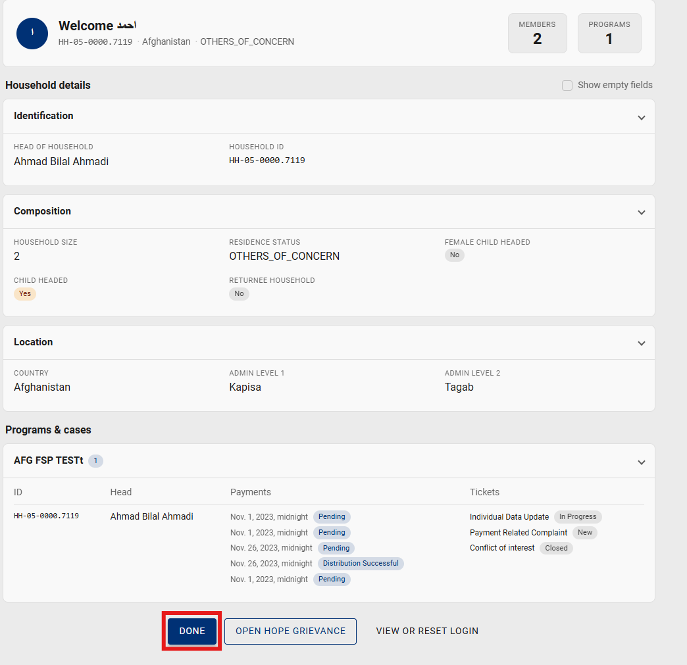
</td>
<td>
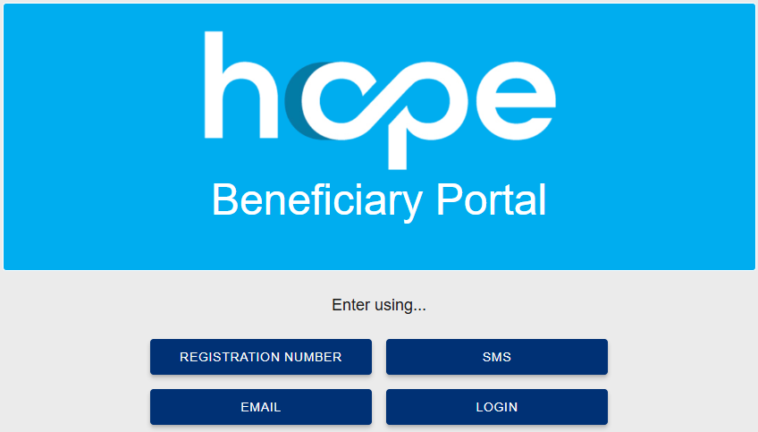
</td>
</tr>
</table>